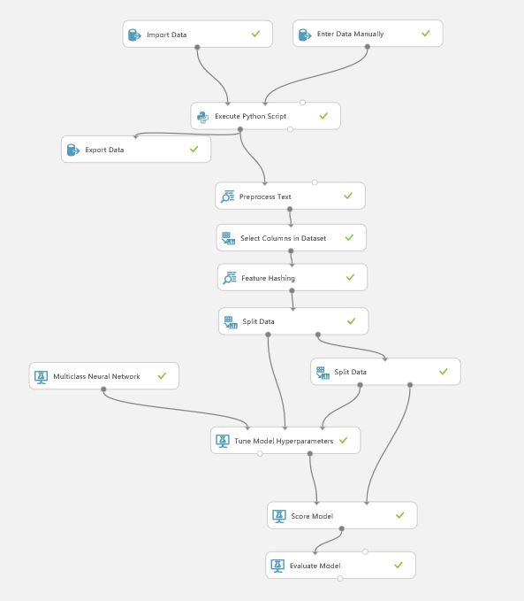

# Using Microsoft cognitive Services within Azure ML Studio to Predict Expense Type from Receipts

In order to predict or recognise the type of expense from a receipt, a database of imaged receipts are first converted into strucutre data via Optical Character Recognition (OCR) to extract the informationn into text format. The extracted texts are then used to train a predictive model. 

Assumptions: 
- A database of imaged receipts already exist.
- Images are stored in Azure Blob Storage.

### 1. Overall structure in Azure ML studio
The figure below shows the overall structure in Azure ML Studio.


This example will load training images from blob storage, extract text using **2.**, the texts are used to train a predictive model using multi-class neural network (default settings), and finally published as a web service. 

### 2. Extract text via Optical Character Recognition (OCR)
This is an example on how you can call Microsoft's Cognitive Services from within Azure ML Studio using the **`Execute Python Script`** module. The Python code below will extract texts out from those images via Microsoft's OCR. This should reside within the **`Execute Python Script`** module. 

```
  # The script MUST contain a function named azureml_main
  # which is the entry point for this module.

  # imports up here can be used to 
  import pandas as pd
  import json
  import time
  import requests
  from io import StringIO
  #from azure.storage.blob import BlockBlobService
  #from azure.storage.blob import PublicAccess

  _url = 'https://api.projectoxford.ai/vision/v1.0/ocr'
  _maxNumRetries = 10

  # The entry point function can contain up to two input arguments:
  #   Param<dataframe1>: a pandas.DataFrame
  #   Param<dataframe2>: a pandas.DataFrame
  def azureml_main(dataframe1 = None, dataframe2 = None):

      # Execution logic goes here
      # print('Input pandas.DataFrame #1:\r\n\r\n{0}'.format(dataframe1))
      VISION_API_KEY = str(dataframe2['Col1'][0])
      df_url_label = dataframe1
      print(df_url_label.shape)
      # If a zip file is connected to the third input port is connected,
      # it is unzipped under ".\Script Bundle". This directory is added
      # to sys.path. Therefore, if your zip file contains a Python file
      # mymodule.py you can import it using:
      # import mymodule
      
      df = pd.DataFrame({'Text' : [], 'Category' : [], 'ReceiptID' : []})
      
      for index, row in df_url_label.iterrows():
          imageurl = row['Url']
          # OCR parameters
          params = { 'language': 'en', 'detectOrientation ': 'true'} 
          headers = dict()
          headers['Ocp-Apim-Subscription-Key'] =  VISION_API_KEY
          headers['Content-Type'] = 'application/json' 
          
          image_url = { 'url': imageurl } ; 
          image_file = None
          result = processRequest( image_url, image_file, headers, params )
          
          if result is not None:
              # extract text
              text = extractText(result); #print (text)
              
              # populate dataframe
              df.loc[index,'Text'] = text
          else:
              # populate dataframe
              df.loc[index,'Text'] = None
                          
          df.loc[index,'Category'] = row['Category']
          df.loc[index,'ReceiptID'] = imageurl[-17:-4]
          
      # Return value must be of a sequence of pandas.DataFrame
      return df

  # Extract text only from OCR's response
  def extractText(result):
      text = ""
      for region in result['regions']:
          for line in region['lines']:
              for word in line['words']:
                  #print (word.get('text'))
                  text = text + " " + word.get('text')
      return text
  
  # Process request
  def processRequest( image_url, image_file, headers, params ):

      """
      Ref: https://github.com/Microsoft/Cognitive-Vision-Python/blob/master/Jupyter%20Notebook/Computer%20Vision%20API%20Example.ipynb
      Helper function to process the request to Project Oxford
      Parameters:
      json: Used when processing images from its URL. See API Documentation
      data: Used when processing image read from disk. See API Documentation
      headers: Used to pass the key information and the data type request
      """

      retries = 0
      result = None

      while True:

          response = requests.request( 'post', _url, json = image_url, data = image_file, headers = headers, params = params )
          
          if response.status_code == 429: 

              print( "Message: %s" % ( response.json()['message'] ) )

              if retries <= _maxNumRetries: 
                  time.sleep(1) 
                  retries += 1
                  continue
              else: 
                  print( 'Error: failed after retrying!' )
                  break

          elif response.status_code == 200 or response.status_code == 201:

              if 'content-length' in response.headers and int(response.headers['content-length']) == 0: 
                  result = None 
              elif 'content-type' in response.headers and isinstance(response.headers['content-type'], str): 
                  if 'application/json' in response.headers['content-type'].lower(): 
                      result = response.json() if response.content else None 
                  elif 'image' in response.headers['content-type'].lower(): 
                      result = response.content
          else:
              print(response.json()) 
              print( "Error code: %d" % ( response.status_code ) ); 
              print( "Message: %s" % ( response.json()['message'] ) ); 

          break
          
      return result
```

### 3. Mobile app to consume the published expense predictor

This can be achieved by using this [xamarin-based mobile phone app](https://github.com/ryubidragonfire/receipt-recognition) under `MobileApp` folder (this is only an example), where the app will take a picture of a receipt, send it to the [web service](https://services.azureml.net/subscriptions/04f7ec88-8e28-41ed-8537-5e17766001f5/resourceGroups/agitare/providers/Microsoft.MachineLearning/webServices/09112016NN6Class.2016.11.9.22.6.12.701), and a predicted type of expense will be returned. This is the [video demonstration](https://youtu.be/1lCMWmS2Tmc). 


